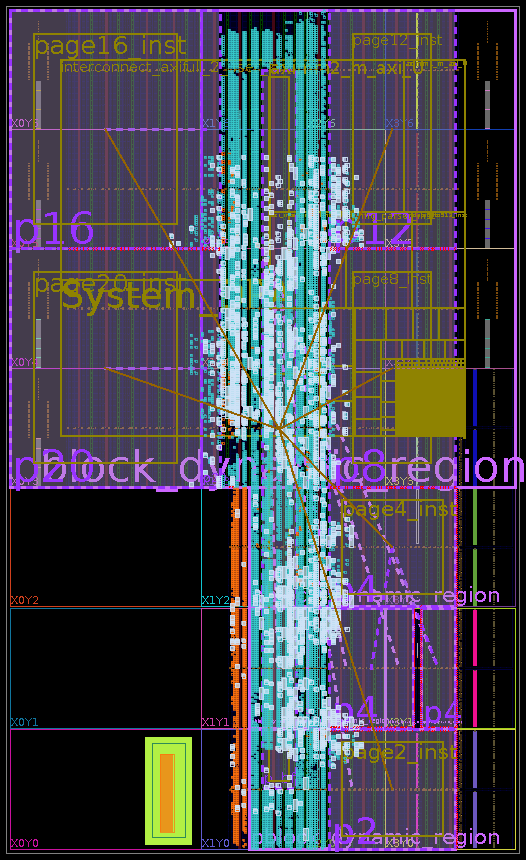
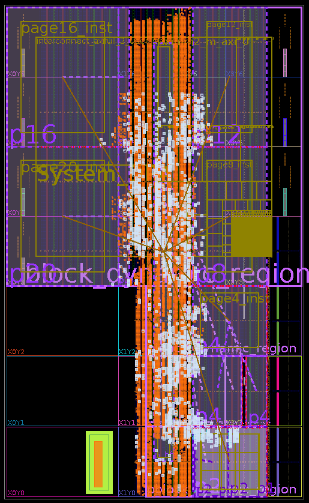
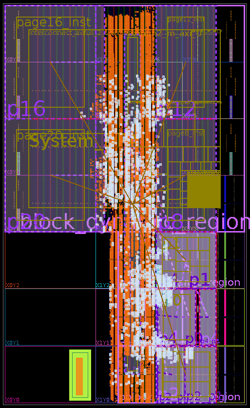
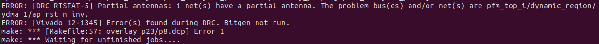
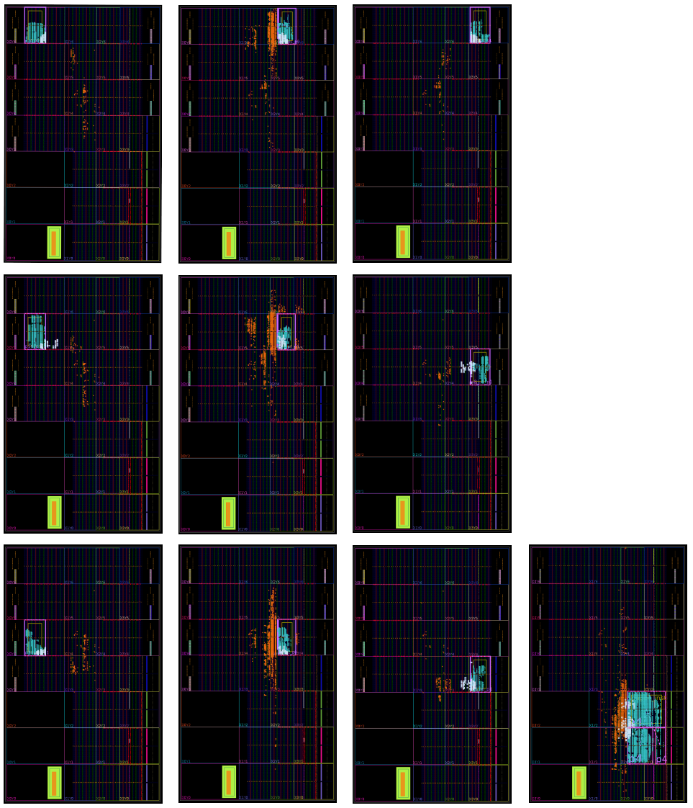
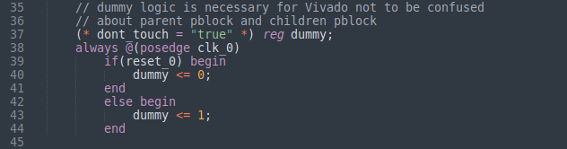

# Separate Compilations with Variable-sized Pages using Nested DFX

<!-- 
## 1 Tool Setup

### 1.1 Vitis Preparation
The demo is developed with [Vitis 2021.1](https://www.xilinx.com/support/download/index.html/content/xilinx/en/downloadNav/vivado-design-tools/2021-1.html) 
and [Ultra96v2 board](https://www.96boards.org/product/ultra96/).
The default Vitis does not include Ultra96v2 BSP. You can copy the dir **ultra96v2**
under [BSP](./BSP) to \<Vitis Installation DIR\>/Vivado/2021.1/data/xhub/boards/XilinxBoardStore/boards/Xilinx.
If you install Vitis under **/opt/Xilinx/**, you should set the **Xilinx_dir** in  [./common/configure/ultra96/configure.xml](./common/configure/ultra96/configure.xml) as below.
```c
    <spec name = "Xilinx_dir" value = "/scratch/unsafe/SDSoC/Vivado/2021.1/settings64.sh" />
```


### 1.2  Vitis Embedded SDK Installation
Embedded MPSoC ARMs need the specific SDK to compile the host code. Download [ZYNQMP common image](https://www.xilinx.com/support/download/index.html/content/xilinx/en/downloadNav/embedded-platforms/2021-1.html) and extract the **xilinx-zynqmp-common-v2021.1.tar.gz** file to **/opt/**. Go to **/opt/xilinx-zynqmp-common-v2021.1** and execute **./sdk.sh -y -dir sdk -p**, you should see the setup script (**/opt/xilinx-zynqmp-common-v2021.1/ir/environment-setup-cortexa72-cortexa53-xilinx-linux**).
If you install the SDK under **/opt/xilinx/platforms/**, you should set the features correctly in  [./common/configure/ultra96/configure.xml](./common/configure/ultra96/configure.xml) as below.

```c
   <spec name = "sdk_dir"             value = "/opt/xilinx/platforms/xilinx-zynqmp-common-v2021.1/ir/environment-setup-cortexa72-cortexa53-xilinx-linux" />
```

### 1.3  Ultra96 DFX Platform Preparation
I got the DFX platform from [https://github.com/matth2k](https://github.com/matth2k). If you copy the **platforms/xilinx_ultra96_base_dfx_202110_1** to **/opt/xilinx/platforms/**, you should set the feature correctly in  [./common/configure/ultra96/configure.xml](./common/configure/ultra96/configure.xml) as below.

```c
  <spec name = "PLATFORM_REPO_PATHS" value=  "/opt/xilinx/platforms/xilinx_ultra96_base_dfx_202110_1" />
  <spec name = "ROOTFS"              value = "/opt/xilinx/platforms/xilinx_ultra96_base_dfx_202110_1/sw/xilinx_ultra96_base_dfx_202110_1/Petalinux/rootfs" />
  <spec name = "PLATFORM"            value = "xilinx_ultra96_base_dfx_202110_1" />
```


### 1.4 RISC-V Tool Praparation

The RISC-V toolchain is based on picorv32 repo. You can install the RISC-V toolchain with 
this commit tag (411d134).
We copy the installation guide from [picorv32](https://github.com/cliffordwolf/picorv32) 
as below.

    git clone https://github.com/riscv/riscv-gnu-toolchain
    cd riscv-gnu-toolchain/
    git reset --hard b39e36160aa0649ba0dfb9aa314d375900d610fb
    ./configure --prefix=/opt/riscv32 --with-arch=rv32im
    make

 If install the riscv-toolchain under  **/opt/riscv32i**, you should set the feature correctly in  [./common/configure/configure.xml](./common/configure/configure.xml) as below.
```c
<spec name = "riscv_dir"          value = "/opt/riscv32i" />
```

**You don't need to install RISC-V toolchain if you only need to run hardware 
implementation.**

## 2 Benchmark Preparation
1. To get our [Makefile](./Makefile) to work, you need to copy your application cpp
code to a certain directory. We take 
**rendering2** as an example.
2. You can create the directory [rendering2](./input_src) with the same 
name as the benchmark under '**./input_src**'.
3. We create one cpp file and one header file for each operator. In 
[./input_src/rendering/operators](./input_src/rendering/operators), we
can see 2 operators to be mapped to partial reconfigurable pages.
The directory structure is as below.

```c
├── input_src
│   └── rendering2
│       ├── cfg
│       │   ├── u50.cfg
│       ├── host
│       │   ├── host.cpp
│       │   ├── input_data.h
│       │   ├── top.cpp
│       │   ├── top.h
│       │   └── typedefs.h
│       ├── Makefile
│       ├── operators
│       │   ├── data_redir_m.cpp
│       │   ├── data_redir_m.h
│       │   ├── rasterization2_m.cpp
│       │   └── rasterization2_m.h
│       └── sw_emu
│           ├── build_and_run.sh
│           ├── Makefile
│           └── xrt.ini
```

4. We can set the page number and target (HW or RISC-V) in the header file
for each [operator](input_src/rendering2/operators/data_redir_m.h).

```c
    #pragma map_target = HW page_num = 2 inst_mem_size = 65536
```

5. Currently, we use a **top** function in [./input_src/rendering2/host/top.cpp](./input_src/rendering2/host/top.cpp)
to show how to connect different operators together. Our python script 
([runtime.py](./pr_flow/runtime.py)) will
parse the top.cpp and operator header files to extract the interconnection,
and generate the configuration packets.
 


## 3 Tutorial 1: Map all Operators to Hardware
1. After you set up all the necessary tools, you need to set the directory 
for Vitis and RISC-V toolchain in [configure.xml](./common/configure/configure.xml).
```c
    <spec name = "Xilinx_dir" value = "/scratch/unsafe/SDSoC/Vivado/2021.1/settings64.sh" />
    <spec name = "RISC-V_dir"  value = "/scratch/unsafe/RISCV/RISC-V32i" />
```
2. You can also define specific features for ultra96 board in [comfigure.xml](./common/configure/ultra96/configure.xml), which overlaps the previous settings.

3. In the [Makefile](./Makefile), change the **prj_name** to **rendering2**.
```c
    prj_name=rendering
```

3. Type '**Make -j$(nproc)**'. It will generate all the necessary DCP and 
bitstream files automatically. Different operators can be compiled in 
parallel according to the thread number of your local machine. Be careful
with the memory requirements, when you use multi-threads to compile the 
project. When I use 8 threads to compile, I at least need 32 GB DDR 
memory.
```c
Make -j$(nproc)
```

4. After all the compile tasks are completed, you can see the abstract shell dcp for each DFX pages under [.workspace/F001_overlay/ydma/ultra96/ultra96_dfx_manual/checkpoint](workspace/F001_overlay/ydma/ultra96/ultra96_dfx_manual/checkpoint).

5. This [link](https://www.hackster.io/mohammad-hosseinabady2/ultra96v2-linux-based-platform-in-xilinx-vitis-2020-1-06f226) shows how to use **GParted** to prepare the SD card to boot the Ultra96 board with Linux. It mainly partitions the SD card into **BOOT** and **rootfs** parts as below.


6.  Copy the boot files to **BOOT**.


```c
cp <repo root>/workspace/F001_overlay/ydma/ultra96/package/sd_card/* /media/<linux account>/BOOT/
```
Go to the platform directory (such as **/opt/xilinx/platforms/xilinx_ultra96_base_dfx_202110_1/sw/xilinx_ultra96_base_dfx_202110_1/Petalinux/image**) and execute the commands below.

```
sudo tar -zxvf rootfs.tar.gz -C /media/<linux account>/rootfs/
```


7. Copy **BOOT.BIN** and **image.ub** under **./BSP** to the **BOOT** partition in the SD card to overlap the original ones. These two files come from [https://github.com/matth2k](https://github.com/matth2k).

8. Copy all the files to the **BOOT** partition of our SD card for ultra96 boards.

9. Boot up the board and execute the commands below.

```c
mount /dev/mmcblk0p1 /mnt
cd /mnt
export XILINX_XRT=/usr
export XILINX_VITIS=/mnt
./run_app.sh
```

10. You should see the bunny shows up in the terminal.


## 4 Tutorial 2: Map one operator to RISC-V
1. The partial reconfigurable page 2 can be mapped to picorc32 cores.
To make sure the RISC-V core can map 'ap_int.h' and 'ap_fixed.h', the 
smallest bram size it 65536 Bytes. We could only pre-load one page (page 2) with
RISC-V for ultra96, but for ZCU102, we can pre-load 16 RISC-V cores.


2. We are going to switch '**data_redir**' page to RISC-V.
3. Currently, we change the pragma in [data_redir.h](./input_src/rendering2/operators/data_redir_m.h).
```c
    #pragma map_target = RISCV page_num = 2 inst_mem_size = 65536
```
4. Type '**Make**', the RISC-V core for this operator will be re-compiled automatically. Ideally, we should use an ARM to send instruction data through BFT to the pre-loaded RISC-V core. However, this feature is still in progress, and we will place\&reute the RISC-V cores over and over when we make changes to the operator. 

5. Again, copy all the files to the **BOOT** partition of our SD card for ultra96 boards.

6. Boot up the board and execute the commands below.

```c
mount /dev/mmcblk0p1 /mnt
cd /mnt
export XILINX_XRT=/usr
export XILINX_VITIS=/mnt
./run_app.sh
```

6. You should see the bunny shows up in the terminal.
 -->


The starting code is forked from [PLD](https://github.com/icgrp/pld2022) repository
[[Xiao/ASPLOS2022](https://ic.ese.upenn.edu/abstracts/pld_asplos2022.html)].
The main differences are:
1. static design generation using Hierarchical Partial Reconfiguration(a.k.a Nested DFX)
2. synchronization after the synthesis jobs for page assignment

Note that we slightly modified the floorplanning of
[ZCU102 Base DFX platform](https://www.xilinx.com/support/download/index.html/content/xilinx/en/downloadNav/embedded-platforms/2021-1.html) to reserve more area for the dynamic region.
This can be done by modifying [this file](https://github.com/Xilinx/Vitis_Embedded_Platform_Source/blob/2021.1/Xilinx_Official_Platforms/xilinx_zcu102_base_dfx/hw/sources/constraints/static_impl_early.xdc).

## Static design generation

### <a name="overview"></a>Overview

<!-- We want to create pages whose sizes can be single, double and quad depending on the sizes of user operators. -->
As stated in the Xilinx [user guide for PR](https://www.xilinx.com/content/dam/xilinx/support/documents/sw_manuals/xilinx2022_1/ug909-vivado-partial-reconfiguration.pdf#page=62),
the Nested DFX does not allow more than one RP to be subdivided until the first RP has a placed/routed design.
This means that we need a series of subdivisions followed by place/route.
So, we will first subdivide the single RP from the ZCU102 Base DFX platform into 7 children RPs: p2(double page), p4(quad page), p12(quad page), p16(quad page), p20(quad page),
and p_NoC(pblock for NoC).

After the first subdivision, we have a routed design that looks like below.
<p align="center">  </p>


Then, we subdivide p2 and place/route. The routed design after this step looks like below.
<p align="center">  </p>

Open this design and subdivide p4(quad page) into two double pages(p4_p0 and p4_p1). Place/route the design.
<p align="center">  </p>


The subdivisions followed by place/route continue until we subdivide all the large pages into single pages.
The final static design looks like below.
<p align="center">  </p>

When the final routed design is created, **from the final routed design**, we recombine the children pblocks
to generate 'intermediate bitstreams' and abstract shells for each page.
Intermediate bitstream is a bitstream like p4_p1_subdivide.bit.
When you want to load a bitstream on the single page, p4_p1_p0 or p4_p1_p1,
you need to load the associated parent recombined bitstreams to properly set up the context.

**It's important that all the bitstreams and abstract shells are generated from the same routed design.**
In this way, partial bitstreams generated with abstract shells are compatible to each other.

Finally, our framework generates all the utilization reports, excludes the blocked resources,
and outputs a file that contains the information on each PR page's available resources.


### Run the code to generate the static design

To create a static design(overlay) for PR pages, you can simply run the command below in your `/PROJECT_DIR/`.

```
make overlay -j$(nproc)
```

When generating an overlay, you should encounter an `ERROR: [DRC RTSTAT-5] Partial antennas`.



In this case, cd to `/PROJECT_DIR/workspace/F001_overlay/ydma/zcu102/zcu102_dfx_manual/` and open up Vivado GUI with
`vivado &`. In Tcl console, copy and paste the scripts that encountered the errors.
With the given floorplanning(\*.xdc files), scripts that cause this error are:

- `/PROJECT_DIR/workspace/F001_overlay/ydma/zcu102/zcu102_dfx_manual/tcl/nested/pr_recombine_dynamic_region.tcl`
- `/PROJECT_DIR/workspace/F001_overlay/ydma/zcu102/zcu102_dfx_manual/tcl/nested/pr_recombine_p8.tcl`

Once you manually generate `dynamic_region.bit` and `p8.dcp`, you can restart the Makefile in
`/PROJECT_DIR/workspace/F001_overlay/ydma/zcu102/zcu102_dfx_manual/` directory by entering `make all -j24`,
with the number of jobs you want to run in parallel. Then, in the same directory, run the rest of the commands in
`/PROJECT_DIR/workspace/F001_overlay/run.sh` that were supposed to run.

```
./shell/run_xclbin.sh
cd ../../../
cp -r ./ydma/zcu102/package ./ydma/zcu102/zcu102_dfx_manual/overlay_p23/
cp ./ydma/zcu102/zcu102_dfx_manual/overlay_p23/*.xclbin ./ydma/zcu102/zcu102_dfx_manual/overlay_p23/package/sd_card
mv parse_ovly_util.py ./ydma/zcu102/zcu102_dfx_manual/overlay_p23/
mv get_blocked_resources.py ./ydma/zcu102/zcu102_dfx_manual/overlay_p23/
cd ./ydma/zcu102/zcu102_dfx_manual/overlay_p23/ && python get_blocked_resources.py
python parse_ovly_util.py
```

This conclues overlay generation and creates `/PROJECT_DIR/workspace/F001_overlay/` directory.
If you are interested in the Nested DFX,
please take a look at [Setting PR Hierarchy in Vivado](#Setting-PR-Hierarchy-in-Vivado)


## Compile Optical Flow benchmark

cd to `/PROJECT_DIR/` and in [Makefile](Makefile), select the `prj_name`. Then,
```
make all -j$(nproc)
```

This will run HLS, Vivado synthesis for each operator in parallel.
It synchronizes after the synthesis, and based on the resource utilization estimates, it 
assigns appropriate pages(single, double, or quad), and launches implementations to generated partial bitstreams.

For [Optical Flow (96, mix)](./input_src/optical_flow_96_final) benchmark,
10 operators will be copmiled separately in parallel. Note that 9 operators are mapped on single pages,
and one operator is mapped on a quad page (the bottom right).

<p align="center">  </p>


## Known Issues

### Setting PR Hierarchy in Vivado

If you take a close look at our code, 
1. we are 'unnecessarily' generating duplicate 'page_double_subdivide_*.dcp' or 'page_quad_subdivide_*.dcp' in
   `/PROJECT_DIR/workspace/F001_overlay/ydma/zcu102/zcu102_dfx_manual/overlay_p23/subdivide`
2. and in the verilog sources files for the designs above
   (e.g. `/PROJECT_DIR/workspace/F001_overlay/ydma/zcu102/zcu102_dfx_manual/p_d_s_p2.v`), there's a dummy register.

   

In the course of generating single pages,
we are reading the same synthesized quad page checkpoints and double page checkpoints.
We experience that sometimes Vivado does not understand the hierarchy of the pages.
For instance,
p4 is the parent pblock of p4_p0 and p4_p1. p4_p0 is the parent block of p4_p0_p0 and p4_p0_p1, but
Vivado sometimes doesn't recognize such hierarchy.

We manage to resolve this issue by creating a separate synthesized checkpoint for each double page and
quad page to be subdivided, like 'page_double_subdivide_*.dcp' or 'page_quad_subdivide_*.dcp'.
Furthermore, while our double page consists of two single pages and nothing else left 
other than some routing to the single pages,
we place a dummy register. 
In this way, Vivado seems to understand the PR hierarchy.

It's true that in the Xilinx [user guide for PR tutorial](https://docs.xilinx.com/r/en-US/ug947-vivado-partial-reconfiguration-tutorial),
there is no example design that has multiple parent RPs.
If you can share your experience, it should be really helpful!


