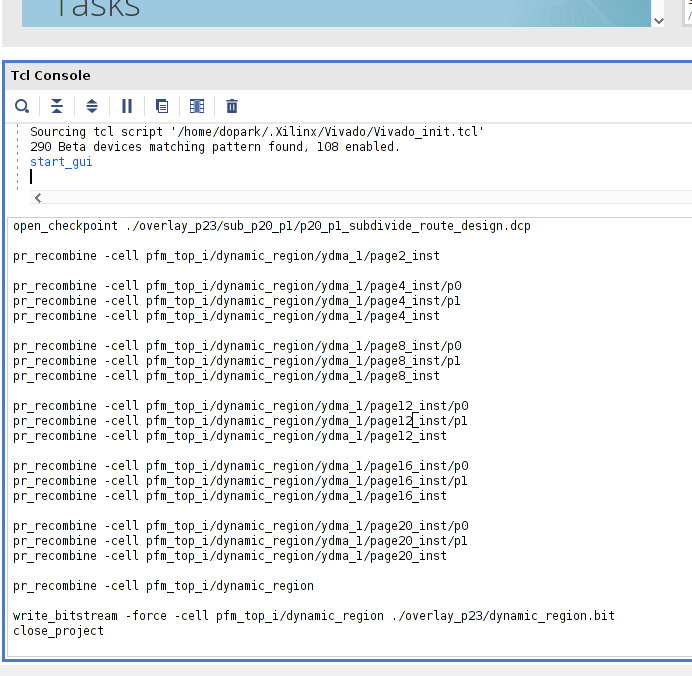
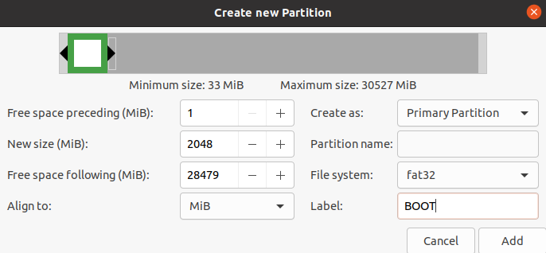
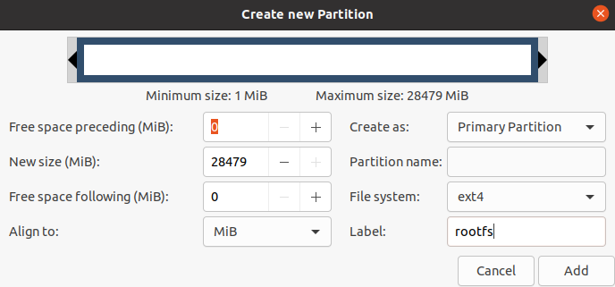

# Fast and Flexible FPGA development using Hierarchical Partial Reconfiguration
To address slow FPGA compilation, researchers
have proposed to run separate compilations for smaller design
components using Partial Reconfiguration 
([[Xiao/FPT2019](https://ic.ese.upenn.edu/abstracts/prflow_fpt2019.html), [Xiao/ASPLOS2022](https://ic.ese.upenn.edu/abstracts/pld_asplos2022.html)]).
Different from the previous works, this work provides **variable-sized** ***pages*** **that
are hierarchically recombined from multiple smaller pages** depending on the size
of user operators.
This unique capability not only accelerates FPGA compilation but also relieves users of the 
burden to fit the operators to the fixed-sized pages. For more details, please refer to our FPT2022 paper.

The starting code is forked from [PLD](https://github.com/icgrp/pld2022) repository
[[Xiao/ASPLOS2022](https://ic.ese.upenn.edu/abstracts/pld_asplos2022.html)].
The main differences are:
1. static design generation using Hierarchical Partial Reconfiguration(a.k.a Nested DFX), thereby providing variable-sized PR pages
2. synchronization after the synthesis jobs for automatic page assignment

## Setup
The framework is developed with Ubuntu 20.04 with kernel 5.4.0,
[Vitis 2021.1](https://www.xilinx.com/support/download/index.html/content/xilinx/en/downloadNav/vivado-design-tools/2021-1.html) 
and Xilinx ZCU102 evaluation board.

### Vitis
If you install Vitis on **/tools/Xilinx**, you should set **Xilinx_dir** 
in [./common/configure/configure.xml](./common/configure/configure.xml) as below.
```xml
  <spec name = "Xilinx_dir" value = "/tools/Xilinx/Vitis/2021.1/setting64.sh" />
```

### Common image
The ZYNQMP common image file can be downloaded from the [Vitis Embedded Platforms](https://www.xilinx.com/support/download/index.html/content/xilinx/en/downloadNav/embedded-platforms/2021-1.html)
page.
Locate the image to the directory of your choice(e.g. /opt/platforms/), and adjust the configuration in 
[./common/configure/zcu102/configure.xml](./common/configure/zcu102/configure.xml) as below.
```xml
  <spec name = "sdk_dir"             value = "/opt/platforms/xilinx-zynqmp-common-v2021.1/ir/environment-setup-cortexa72-cortexa53-xilinx-linux" />
```

### ZCU102 Base DFX platform
You can create ZCU102 Base DFX paltform from 
[Vitis Embedded Platform Source repo](https://github.com/Xilinx/Vitis_Embedded_Platform_Source/tree/2021.1).
We slightly modified the floorplanning of ZCU102 Base DFX platform
to reserve more area for the dynamic region.
This can be done by replacing 
[this file](https://github.com/Xilinx/Vitis_Embedded_Platform_Source/blob/2021.1/Xilinx_Official_Platforms/xilinx_zcu102_base_dfx/hw/sources/constraints/static_impl_early.xdc) 
to our [modified xdc file](./common/etc/static_impl_early.xdc).
You can follow the instructions to generate the ZCU102 DFX platform.
For instance, 
```bash
cd ./Xilinx_Official_Platforms/xilinx_zcu102_base_dfx/
source /PETALINUX_DIR/petalinux/2021.1/settings.sh
make all
```

Once you successfully generated ZCU102 DFX platform, locate the generated platform to the directory of your choice(e.g. /opt/platforms/),
and adjust the configurations in [./common/configure/zcu102/configure.xml](./common/configure/zcu102/configure.xml) as below.
```xml
  <spec name = "PLATFORM_REPO_PATHS" value=  "/opt/platforms/xilinx_zcu102_base_dfx_202110_1" />
  <spec name = "ROOTFS"              value = "/opt/platforms/xilinx_zcu102_base_dfx_202110_1/sw/xilinx_zcu102_base_dfx_202110_1/xrt/filesystem" />
  <spec name = "PLATFORM"            value = "xilinx_zcu102_base_dfx_202110_1" />
```

## Static design generation

### <a name="overview"></a>Overview

<!-- We want to create pages whose sizes can be single, double and quad depending on the sizes of user operators. -->
As stated in the Xilinx [user guide for PR](https://www.xilinx.com/content/dam/xilinx/support/documents/sw_manuals/xilinx2022_1/ug909-vivado-partial-reconfiguration.pdf#page=62),
the Nested DFX does not allow more than one RP to be subdivided until the first RP has a placed/routed design.
This means that we need a series of subdivisions followed by place/route.
Therefore, we will first subdivide the single RP from the ZCU102 Base DFX platform into 7 children RPs: p2(double page), p4(quad page), p12(quad page), p16(quad page), p20(quad page),
and p_NoC(pblock for NoC).

After the first subdivision, we have a routed design that looks like below.
<p align="center">  </p>


Then, we subdivide p2 and place/route. The routed design after this step looks like below.
<p align="center">  </p>

Open this design and subdivide p4(quad page) into two double pages(p4_p0 and p4_p1). Place/route the design.
<p align="center">  </p>


The subdivisions followed by place/route continue until we subdivide all the large pages into single pages.
The final static design looks like below.
<p align="center">  </p>

When the final routed design is created, **from the final routed design**, we recombine the children pblocks
to generate 'intermediate bitstreams' and abstract shells for each page.
Intermediate bitstream is a bitstream like p4_p1_subdivide.bit.
When you want to load a bitstream on the single page, p4_p1_p0 or p4_p1_p1,
you need to load the associated parent recombined bitstreams to properly set up the context.

**It's important that all the bitstreams and abstract shells are generated from the same routed design.**
In this way, partial bitstreams generated with abstract shells are compatible to each other.

Finally, our framework generates all the utilization reports, excludes the blocked resources,
and outputs a file that contains the information on each PR page's available resources.


### Generate the static design

To create a static design(overlay) for PR pages, you can simply run the command below in your `/<PROJECT_DIR>/`.
Note that this process can take >3 hours depending on the system CPU/RAM.

```
make overlay -j$(nproc)
```

When generating an overlay, you should encounter an `ERROR: [DRC RTSTAT-5] Partial antennas`.


We consider this as a potential bug in Vivado.
In this case, cd to `/<PROJECT_DIR>/workspace/F001_overlay/ydma/zcu102/zcu102_dfx_manual/` and open up **Vivado GUI** with
`vivado &`. In Tcl console, manually copy and paste the contents of the scripts that encountered the errors as shown below.

<p align="center">  </p>

With the given floorplanning(\*.xdc files), scripts that cause this error are:

- `/<PROJECT_DIR>/workspace/F001_overlay/ydma/zcu102/zcu102_dfx_manual/tcl/nested/pr_recombine_dynamic_region.tcl`
- `/<PROJECT_DIR>/workspace/F001_overlay/ydma/zcu102/zcu102_dfx_manual/tcl/nested/pr_recombine_p8.tcl`

Once you manually generate `dynamic_region.bit` and `p8.dcp`, 
cd to 
`/<PROJECT_DIR>/workspace/F001_overlay/ydma/zcu102/zcu102_dfx_manual/` directory 
and continue the Makefile by entering `make all -j$(proc)`. 
Then, in the same directory, run the rest of the commands in
`/<PROJECT_DIR>/workspace/F001_overlay/run.sh` that were supposed to run.
For instance, copy/paste the lines below in the terminal.
```
./shell/run_xclbin.sh
cd ../../../
cp -r ./ydma/zcu102/package ./ydma/zcu102/zcu102_dfx_manual/overlay_p23/
cp ./ydma/zcu102/zcu102_dfx_manual/overlay_p23/*.xclbin ./ydma/zcu102/zcu102_dfx_manual/overlay_p23/package/sd_card
mv parse_ovly_util.py ./ydma/zcu102/zcu102_dfx_manual/overlay_p23/
mv get_blocked_resources.py ./ydma/zcu102/zcu102_dfx_manual/overlay_p23/
cd ./ydma/zcu102/zcu102_dfx_manual/overlay_p23/ && python get_blocked_resources.py
python parse_ovly_util.py
```

This conclues overlay generation and creates `/<PROJECT_DIR>/workspace/F001_overlay/` directory.
You are now ready to separately compile operators in parallel with different sizes of PR pages!
If you are interested in the Nested DFX,
please take a look at [Setting PR Hierarchy in Vivado](#Setting-PR-Hierarchy-in-Vivado).


## Compile Optical Flow benchmark

cd to `/<PROJECT_DIR>/` and in [Makefile](Makefile), select the `prj_name` with your choice of benchmark. Then,
```
make all -j$(nproc)
```

This will run HLS, Vivado synthesis for each operator in parallel.
It synchronizes after the synthesis, and based on the resource utilization estimates, it 
assigns appropriate pages(single, double, or quad), and launches implementations to generated partial bitstreams.

For [Optical Flow (96, mix)](./input_src/optical_flow_96_final) benchmark,
10 operators will be copmiled separately in parallel. Note that 9 operators are mapped on single pages,
and one operator is mapped on a quad page (the bottom right).

<p align="center">  </p>

## Run on the device
Once you successfully generated separate `.xclbin` files and host executable in 
`/<PROJECT_DIR>/workspace/F005_bits_optical_flow512_96_final/sd_card/` directory,

1. Use **GParted** to prepare a SD card to boot the ZCU102 board.
<p align="center">  </p>
<p align="center">  </p>

2. Copy the boot files to **BOOT**.
```
cp /<PROJECT_DIR>/workspace/F001_overlay/ydma/zcu102/zcu102_dfx_manual/overlay_p23/package/sd_card/* /media/<YOUR_ACCOUNT>/BOOT/
```

3. Copy rootfs files to **rootfs**. For instance,
```
sudo tar -zxvf /opt/platforms/xilinx_zcu102_base_dfx_202110_1/sw/xilinx_zcu102_base_dfx_202110_1/xrt/filesystem/rootfs.tar.gz -C /media/<YOUR_ACCOUNT>/rootfs/
```

4. Safely unplug the SD card from the workstation and slide it into the ZCU102. Power on the device.

5. You can refer to [this post](https://dj-park.github.io/posts/2022/1/scp-emb/) set up the ip addresses for the workstation and the ZCU102.

6. scp the generated `.xclbin` files and the host executable, like below.
  Note that for the optical flow benchmark, you need to scp [current](./input_src/current) directory too.
  The spam filter benchmark needs [data](./input_src/data) and the digit recognition needs [196data](./input_src/digit_reg_par_40).
```
scp -i ~/.ssh/id_rsa_zcu102 -r ./workspace/F005_bits_optical_flow_96_final/sd_card/* root@10.10.7.1:/media/sd-mmcblk0p1/
```


7. ssh to the ZCU102 and cd `/media/sd-mmcblk0p1/`. Run the application:
```
./run_app.sh
```

## Known Issues

### Setting PR Hierarchy in Vivado

If you take a close look at our code, 
1. we are 'unnecessarily' generating duplicate 'page_double_subdivide_*.dcp' or 'page_quad_subdivide_*.dcp' in
   `/<PROJECT_DIR>/workspace/F001_overlay/ydma/zcu102/zcu102_dfx_manual/overlay_p23/subdivide`
2. and in the verilog sources files for the designs above
   (e.g. `/<PROJECT_DIR>/workspace/F001_overlay/ydma/zcu102/zcu102_dfx_manual/p_d_s_p2.v`), there's a dummy register.

   

In the course of generating single pages,
we are reading the same synthesized quad page checkpoints and double page checkpoints.
We experience that sometimes Vivado does not understand the hierarchy of the pages.
For instance,
p4 is the parent pblock of p4_p0 and p4_p1. p4_p0 is the parent block of p4_p0_p0 and p4_p0_p1, but
Vivado sometimes doesn't recognize such hierarchy.

We manage to resolve this issue by creating a separate synthesized checkpoint for each double page and
quad page to be subdivided, like `page_double_subdivide_*.dcp` or `page_quad_subdivide_*.dcp`.
Furthermore, while our double page consists of two single pages and nothing else left 
other than some routing to the single pages,
we place a dummy register. 
In this way, Vivado seems to understand the PR hierarchy.

It's true that in the Xilinx [user guide for PR tutorial](https://docs.xilinx.com/r/en-US/ug947-vivado-partial-reconfiguration-tutorial),
there is no example design that has multiple parent RPs.
If you can share your experience, it should be really helpful!


